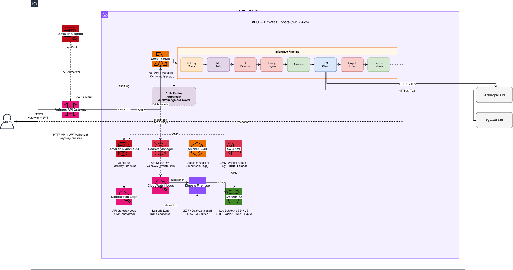
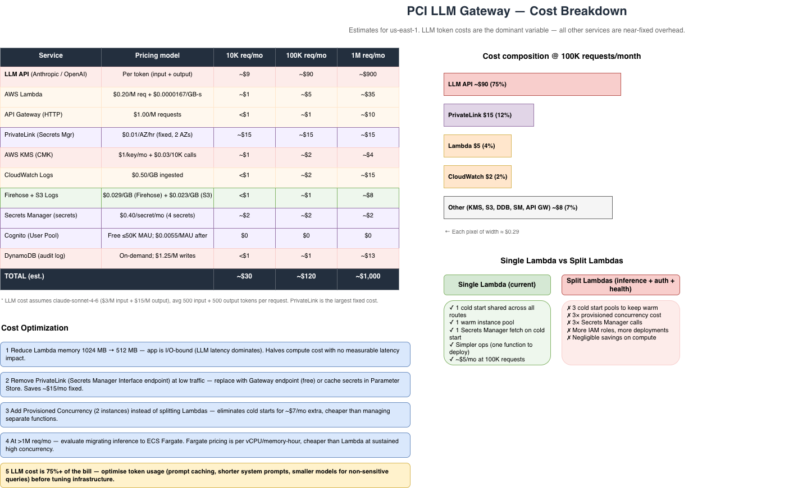

# PCI LLM Gateway

[](https://github.com/csman007/pci-llm-gateway/actions/workflows/tests.yml) [](https://codecov.io/gh/csman007/pci-llm-gateway) [](https://github.com/csman007/pci-llm-gateway/actions/workflows/security.yml) 

A secure API gateway for routing LLM inference requests with PII detection, redaction, and output filtering to meet PCI DSS compliance requirements. Includes an agentic layer with Claude tool use, multi-agent orchestration, extended thinking, SSE streaming, and LLM-as-judge evaluation. Includes a RAG layer grounded in PCI DSS v4.0.1 with hybrid retrieval, deterministic grounding validation, and structured context formatting.

[](https://github.com/csman007/pci-llm-gateway/actions/workflows/lint.yml)

## Architecture

```
Client → API Gateway → PII Detector → Prompt Processor → LLM Client → Output Filter → Client

Agent layer (POST /v1/agent/run, /v1/agent/stream):
  Question → AgentPipeline (PII check) → AgentOrchestrator
    → tool use loop: query_audit_log | analyze_pii_risk | calculator | call_subagent
      → SubagentRunner (compliance / analyst specialist via Haiku)
    → AgentPipeline (validate + restore)
    → LLMJudge (evaluation score)
    → Client

RAG layer (POST /v1/rag/query):
  Question → QueryAnalyzer (Haiku, intent hints)
           → RAGRetriever (pgvector cosine + PostgreSQL BM25 → RRF fusion)
           → _filter_chunks (score threshold + requirement_id dedup)
           → ContextBuilder (structured blocks, char budget)
           → LLM (answer generation, system prompt)
           → GroundingValidator (citation check + semantic claim support)
           → Client
```



## Services

| Service | Description |
|---|---|
| `api-gateway` | FastAPI entry point, auth middleware, request routing |
| `pii-detector` | Regex + ML-based PII/PAN detection |
| `prompt-processor` | Redaction, tokenization, policy enforcement |
| `llm-client` | Anthropic and OpenAI client wrappers |
| `output-filter` | Response validation and leakage detection |
| `agent` | Orchestrator, tools, subagents, evaluator — agentic layer |
| `rag` | Hybrid retrieval, context building, grounding validation — RAG layer |
| `observability` | Structured JSON logging, OTEL tracing, per-request cost tracking |

## Agent endpoints

| Method | Path | Description |
|---|---|---|
| `POST` | `/v1/agent/run` | Run the agent to completion; returns result, tool trace, and evaluation score |
| `POST` | `/v1/agent/stream` | Stream agent work as Server-Sent Events |

**Request body:**

```json
{
  "question": "What PCI DSS requirements apply to audit log retention?",
  "thinking": false,
  "max_tokens": 2048
}
```

Set `thinking: true` to enable extended reasoning (automatically selects `claude-opus-4-7`).

**Response (`/v1/agent/run`):**

```json
{
  "response": "PCI DSS Req 10.5.1 requires audit logs to be retained for at least 12 months...",
  "tool_trace": [
    {"tool_name": "call_subagent", "tool_input": {"agent": "compliance", "question": "..."}, "tool_result": "...", "error": false}
  ],
  "thinking": null,
  "evaluation": {"score": 0.92, "reasoning": "Accurate citation with requirement number."},
  "steps_taken": 2
}
```

**SSE events (`/v1/agent/stream`):**

```
data: {"type": "tool_call", "name": "calculator", "input": {"expression": "365 * 24"}}
data: {"type": "tool_result", "name": "calculator", "result": "8760"}
data: {"type": "text_delta", "text": "There are 8760 hours in a year..."}
data: {"type": "evaluation", "score": 0.95, "reasoning": "Correct and concise."}
data: {"type": "done"}
```

**Tools:**

| Tool | Description |
|---|---|
| `query_audit_log` | Query the DynamoDB audit table (filterable by `user_id`) |
| `analyze_pii_risk` | PII risk assessment — returns entity types and HIGH/MEDIUM/NONE risk level |
| `calculator` | Safe arithmetic via AST inspection (no arbitrary eval) |
| `call_subagent` | Delegate to `compliance` (PCI DSS expert) or `analyst` (audit data interpreter) |

**Tuning (env vars / Terraform variables):** all agent constants have sensible defaults and can be overridden without a code change — set them in `.env` locally or in `terraform.tfvars` for Lambda. See `.env.example` for the full list (`AGENT_MODEL_DEFAULT`, `AGENT_MAX_STEPS`, `JUDGE_MODEL`, etc.).

## RAG endpoint

`POST /v1/rag/query` — answers natural language questions about PCI DSS v4.0.1 with inline citations.

**Request:**

```json
{
  "question": "How long must I retain audit logs?",
  "model": "claude-haiku-4-5-20251001",
  "top_k": 5,
  "max_tokens": 1024
}
```

| Field | Type | Default | Constraints |
|---|---|---|---|
| `question` | `string` | required | non-empty |
| `model` | `string` | `claude-haiku-4-5-20251001` | must be in `models.yaml` |
| `top_k` | `int` | `5` | 1–20 |
| `max_tokens` | `int` | `1024` | 64–4096 |

**Response:**

```json
{
  "answer": "Per Req 10.5.1, audit logs must be retained for at least 12 months...",
  "sources": [
    {"requirement_id": "10.5.1", "section_title": "Requirement 10.5.1", "score": 0.92}
  ],
  "chunks_retrieved": 1,
  "requirement_hints": ["10.5.1", "10.7"],
  "grounding": {
    "is_grounded": true,
    "score": 1.0,
    "unsupported_claims": [],
    "citation_result": {
      "valid": true,
      "cited": ["10.5.1"],
      "retrieved": ["10.5.1"],
      "invalid_citations": [],
      "missing_all_citations": false
    }
  }
}
```

`grounding` is `null` when `GROUNDING_VALIDATE=false` (default). `requirement_hints` lists requirement IDs extracted by QueryAnalyzer before retrieval.

**Ingest PCI DSS before first use:**

```bash
python scripts/ingest_pci_dss.py \
  --url https://www.middlebury.edu/sites/default/files/2025-01/PCI-DSS-v4_0_1.pdf
```

Chunks by requirement section (falls back to sliding-window with 200-char overlap), generates OpenAI `text-embedding-3-small` embeddings in batches of 20, inserts into pgvector.

**Retrieval pipeline:**

1. **QueryAnalyzer** — Haiku call extracts requirement ID hints from the question (non-fatal; failures return `[]`)
2. **Hybrid retrieval** — pgvector cosine similarity + PostgreSQL BM25 (`plainto_tsquery`); results fused via Reciprocal Rank Fusion (RRF, k=60)
3. **Filter** — drops chunks below `RAG_MIN_SCORE`; deduplicates by `requirement_id` (highest-score chunk per requirement kept)
4. **ContextBuilder** — formats chunks as structured blocks with relevance scores, truncated to `CONTEXT_MAX_CHUNK_CHARS` each, total budget `RAG_CONTEXT_BUDGET_CHARS`
5. **LLM answer** — generation with an explicit PCI DSS system prompt
6. **GroundingValidator** — citation regex check + batched semantic claim support (one `embed_batch` call); enabled when `GROUNDING_VALIDATE=true`

**RAG env vars:**

| Env var | Default | Description |
|---|---|---|
| `POSTGRES_DSN` | — | PostgreSQL connection string (required; unset → 503) |
| `RAG_HYBRID` | `true` | Hybrid BM25+vector retrieval |
| `RAG_MIN_SCORE` | `0.0` | Minimum similarity score to keep a chunk |
| `RAG_CONTEXT_BUDGET_CHARS` | `8000` | Max total characters of context passed to LLM |
| `CONTEXT_MAX_CHUNK_CHARS` | `2000` | Max characters per chunk in context block |
| `GROUNDING_VALIDATE` | `false` | Enable GroundingValidator |
| `GROUNDING_THRESHOLD` | `0.82` | Cosine similarity floor for claim support |
| `QUERY_ANALYZER_MODEL` | `claude-haiku-4-5-20251001` | Model for pre-retrieval intent classification |

## Running the app

**With Docker (recommended):**

```bash
cp .env.example .env        # fill in API keys, set JWT_SECRET and ENV=dev
docker compose up --build   # first run — builds the image
docker compose up           # subsequent runs
```

The API is available at `http://localhost:8000`. Changes to `services/` and `models.yaml` hot-reload automatically.

**Without Docker:**

```bash
pip install -r requirements.txt
PYTHONPATH=services/api-gateway:services/pii-detector:services/prompt-processor:services/llm-client:services/output-filter \
  uvicorn main:app --reload --app-dir services/api-gateway
```

**Generate a dev JWT** (requires `ENV=dev` in `.env`):

```bash
curl -s -X POST http://localhost:8000/dev/token \
  -H "Content-Type: application/json" \
  -d '{"sub": "dev-user"}'
```

Or import `postman_collection.json` — the **Generate Token** request saves the token to all other requests automatically.

## Running tests

Install dependencies first:

```bash
pip install -r requirements.txt
```

**Run all tests:**

```bash
pytest
```

**Run with coverage report:**

```bash
pytest --cov=services --cov-report=term-missing
```

**Run with HTML coverage** (open `htmlcov/index.html`):

```bash
pytest --cov=services --cov-report=term-missing --cov-report=html
```

**Run a single test:**

```bash
pytest tests/test_redaction.py::test_pan_detected
```

## Deployment



The app runs as a **container image on AWS Lambda** — not a zip file. Lambda's 250 MB zip limit is too small for this dependency set, so the image is stored in ECR and Lambda pulls it on invocation.

```
docker build → push to ECR → Lambda pulls image → API Gateway invokes Lambda
```

`Mangum` (`main.handler`) bridges Lambda's event/context format and FastAPI's ASGI interface. The same codebase runs locally via uvicorn and in production via Lambda — no code changes needed between environments.

**1. Bootstrap remote state** (one-time, before `terraform init`):

```bash
aws s3api create-bucket --bucket pci-llm-gateway-tfstate --region us-east-1
aws s3api put-bucket-encryption --bucket pci-llm-gateway-tfstate \
  --server-side-encryption-configuration '{"Rules":[{"ApplyServerSideEncryptionByDefault":{"SSEAlgorithm":"AES256"}}]}'
aws s3api put-bucket-versioning --bucket pci-llm-gateway-tfstate \
  --versioning-configuration Status=Enabled
aws dynamodb create-table --table-name pci-llm-gateway-tfstate-lock \
  --attribute-definitions AttributeName=LockID,AttributeType=S \
  --key-schema AttributeName=LockID,KeyType=HASH \
  --billing-mode PAY_PER_REQUEST
```

**2. Configure secrets and provision infrastructure:**

```bash
cd infra/terraform
cp terraform.tfvars.example terraform.tfvars   # fill in your real values
terraform init
terraform apply
```

Terraform creates the Secrets Manager secrets, populates the values, and wires the ARNs into Lambda in one step. `terraform.tfvars` is gitignored — never commit it.

For CI/CD, pass secrets as environment variables instead of a file (Terraform picks up `TF_VAR_*` automatically):

```bash
TF_VAR_anthropic_api_key="sk-ant-..." \
TF_VAR_openai_api_key="sk-..." \
TF_VAR_jwt_secret="..." \
TF_VAR_api_key="..." \
terraform apply
```

**3. Build and push the image:**

```bash
docker build -f infra/docker/Dockerfile -t pci-llm-gateway .

aws ecr get-login-password --region us-east-1 | \
  docker login --username AWS --password-stdin <account_id>.dkr.ecr.us-east-1.amazonaws.com

docker tag pci-llm-gateway <ecr_repo_url>:latest
docker push <ecr_repo_url>:latest
```

In a CI/CD pipeline steps 2 and 3 run automatically on every merge to main.

## Secrets management

Sensitive values are never stored as plain Lambda environment variables. Instead:

| Value | Storage | How the app reads it |
|---|---|---|
| `ANTHROPIC_API_KEY` | Secrets Manager | ARN passed as `ANTHROPIC_API_KEY_SECRET_ARN` env var, fetched at cold start |
| `OPENAI_API_KEY` | Secrets Manager | ARN passed as `OPENAI_API_KEY_SECRET_ARN` env var, fetched at cold start |
| `JWT_SECRET` | Secrets Manager (prod) / `.env` (dev) | ARN passed as `JWT_SECRET_ARN` in prod; plain `JWT_SECRET` in dev |
| `API_KEY` | Secrets Manager (prod) / `.env` (dev, optional) | ARN passed as `API_KEY_SECRET_ARN` in prod; plain `API_KEY` in dev (unset = check disabled) |
| `LOG_LEVEL`, `ENV`, Cognito IDs | Lambda env vars | Not sensitive — stored as plain config |

`secret_resolver.py` fetches values via `boto3` on first use and caches them with `@lru_cache` so only one Secrets Manager call is made per cold start. Local dev bypasses Secrets Manager entirely — plain env vars from `.env` are used when no `*_SECRET_ARN` var is present.

## Authentication

| Environment | How tokens are issued | How tokens are validated |
|---|---|---|
| `ENV=dev` (local) | `POST /dev/token` — issues HS256 token signed with `JWT_SECRET` | `AuthMiddleware` validates with `JWT_SECRET` |
| Production | `POST /auth/login` — Cognito `USER_PASSWORD_AUTH`; first login triggers `NEW_PASSWORD_REQUIRED`, complete with `POST /auth/change-password` | API Gateway Cognito JWT Authorizer at the edge; `AuthMiddleware` validates via Cognito JWKS |

Every request (except `/health` and `/dev/token`) also requires a valid `x-api-key` header. In production the key is fetched from Secrets Manager; in local dev, leave `API_KEY` unset to disable the check.

In Postman, set the `api_key` collection variable. Use **Generate Token (dev only)** locally or **Login via Cognito (prod)** — both auto-save the token to `jwt_token`.

## Environment Variables

**Local dev** (`.env` file):

| Variable | Description |
|---|---|
| `ENV` | Set to `dev` — enables `/dev/token` and HS256 auth |
| `JWT_SECRET` | HS256 signing secret — `python -c "import secrets; print(secrets.token_hex(32))"` |
| `ANTHROPIC_API_KEY` | Anthropic API key |
| `OPENAI_API_KEY` | OpenAI API key |
| `LOG_LEVEL` | Logging verbosity (default: `INFO`) |
| `API_KEY` | Optional — set to enforce `x-api-key` validation locally; unset to disable |

**Production** (Lambda env vars — set by Terraform, no secrets in plain text):

| Variable | Description |
|---|---|
| `ENV` | `prod` |
| `LOG_LEVEL` | Logging verbosity |
| `AWS_REGION_NAME` | AWS region (e.g. `us-east-1`) |
| `COGNITO_USER_POOL_ID` | Cognito User Pool ID |
| `COGNITO_CLIENT_ID` | Cognito App Client ID |
| `ANTHROPIC_API_KEY_SECRET_ARN` | Secrets Manager ARN for the Anthropic key |
| `OPENAI_API_KEY_SECRET_ARN` | Secrets Manager ARN for the OpenAI key |
| `JWT_SECRET_ARN` | Secrets Manager ARN for the JWT secret |
| `API_KEY_SECRET_ARN` | Secrets Manager ARN for the API key (`x-api-key` header) |

## Concurrency & Scaling

### Throughput capacity

The app runs on AWS Lambda. Throughput is bounded by reserved concurrency and average request latency:

```
peak throughput (req/s) = reserved_concurrency / avg_latency_secs
```

| Config | Value | Notes |
|---|---|---|
| Reserved concurrency | 50 (default) | Set via `var.lambda_reserved_concurrency` in Terraform |
| Typical LLM latency | 1–5 s | Varies by model and token count |
| **Peak throughput** | **10–50 req/s** | At 50 concurrency |
| Memory | 1024 MB | Each instance handles one request at a time |

### Backpressure

When all 50 reserved slots are occupied, Lambda throttles new invocations with `429 TooManyRequestsException`. API Gateway propagates this as an HTTP `429` to callers. No queue sits in front — callers are responsible for exponential back-off with jitter.

For async workloads (batch compliance scans, bulk ingestion), place an SQS queue in front of Lambda: the queue absorbs spikes, and Lambda consumes at its concurrency ceiling without dropping requests.

### Rate limiting

Every authenticated endpoint is rate-limited per user (JWT `sub` claim) using a DynamoDB fixed-window counter. Limits are configurable per endpoint:

| Endpoint | Default | Env var |
|---|---|---|
| `POST /v1/inference` | 60 req/min | `RATE_LIMIT_INFERENCE_RPM` |
| `POST /v1/rag/query` | 20 req/min | `RATE_LIMIT_RAG_RPM` |
| `POST /v1/agent/run` + `/stream` | 30 req/min | `RATE_LIMIT_AGENT_RPM` |

On breach: `429` with `Retry-After`, `X-RateLimit-Limit`, `X-RateLimit-Remaining`, and `X-RateLimit-Reset` headers. DynamoDB errors fail-open — a table outage never blocks requests. Rate limiting is disabled locally when `RATE_LIMIT_TABLE` is unset.

### Circuit breakers

Each LLM provider (Anthropic, OpenAI) has an in-process circuit breaker that prevents cascading failures:

```
CLOSED ──(≥5 provider failures in 60s)──► OPEN ──(after 30s)──► HALF_OPEN
  ▲                                                                    │
  └──────────────────────(first success)──────────────────────────────┘
```

- **OPEN** state returns `503 Service Unavailable` with `Retry-After` immediately — no LLM call is made.
- Only provider failures (`429`, `5xx` from the LLM API) trip the circuit. Auth errors (`401`) pass through.
- Circuit state is per Lambda instance (in-process). Across all instances under load, individual circuits provide local protection against a degraded provider.

All thresholds (`CIRCUIT_BREAKER_FAILURE_THRESHOLD`, `CIRCUIT_BREAKER_FAILURE_WINDOW_SECS`, `CIRCUIT_BREAKER_RECOVERY_TIMEOUT_SECS`) are configurable via env vars.

---

## Observability

Every inference and RAG request emits structured JSON logs, distributed traces, and per-request cost data.

### Structured logs

All logs are emitted as single-line JSON (one object per log record):
```json
{
  "timestamp": "2026-05-14T12:00:00.000Z",
  "level": "INFO",
  "logger": "inference",
  "message": "inference_complete",
  "trace_id": "4bf92f3577b34da6a3ce929d0e0e4736",
  "span_id": "00f067aa0ba902b7",
  "stage": "llm_complete",
  "latency_ms": 142,
  "prompt_tokens": 312,
  "completion_tokens": 128,
  "total_cost_usd": 0.0028
}
```

`configure_logging()` in `services/observability/structured_logger.py` replaces the root logger's handlers at startup. The `stage_span` context manager times each pipeline stage and logs it on exit.

### OpenTelemetry tracing

Set `OTEL_ENABLED=true` to export spans to any OTLP HTTP endpoint (Jaeger, Grafana Tempo, AWS X-Ray ADOT collector, etc.). Disabled by default — zero overhead when off.

| Env var | Default | Description |
|---|---|---|
| `OTEL_ENABLED` | `false` | Enable OTLP span export |
| `OTEL_EXPORTER_OTLP_ENDPOINT` | `""` | OTLP HTTP endpoint (e.g. `http://localhost:4318`) |
| `OTEL_SERVICE_NAME` | `pci-llm-gateway` | Service name on all spans |

### Cost tracking

`calculate_cost(model, prompt_tokens, completion_tokens)` in `services/observability/token_counter.py` uses a per-model pricing table ($/M tokens) and returns `input_cost_usd`, `output_cost_usd`, and `total_cost_usd` for every LLM call. The result is included in the `inference_complete` and `rag_complete` log entries.

### Services table

| Service | Path | Purpose |
|---|---|---|
| `observability` | `services/observability/` | Structured logging, OTEL tracing, cost tracking |

---

## PII Detection & Policy

Every prompt is scanned before it reaches the LLM. Detected entities are either **blocked** (request rejected with `400`) or **redacted** (replaced with a placeholder token, restored in the response).

### Detected entity types

| Entity | Method | How it works |
|---|---|---|
| `PAN` | Regex + Luhn | Matches 13–19 digit sequences (with optional spaces/dashes); only flagged if the number passes the Luhn checksum |
| `CVV` | Regex (context) | Matches 3–4 digits preceded by keywords: `cvv`, `cvc`, `security code` |
| `EXPIRY` | Regex (context) | Matches `MM/YY` or `MM/YYYY` preceded by keywords: `expiry`, `exp date`, `valid thru/through/until`; month validated as 01–12 |
| `SSN` | Regex | Matches `123-45-6789` or `123456789` |
| `EMAIL` | Regex | Standard email format |
| `PHONE` | Regex | US phone numbers with optional `+1` prefix |

CVV and EXPIRY require keyword context (e.g. `expiry: 09/26`) to avoid false positives on bare numbers that appear naturally in text.

### Policy rules

| Rule | Behaviour |
|---|---|
| `PAN`, `CVV`, `SSN`, `EXPIRY` detected | Request blocked — `400` |
| `EMAIL`, `PHONE` detected | Redacted before sending to LLM, restored in response |
| More than 5 PII entities in one request | Request blocked — `400` |
| LLM response contains PII not in the original prompt | Response blocked — `502` |

### LLM error handling

| Situation | Status |
|---|---|
| Insufficient credits / quota | `402` with provider-specific message |
| Invalid API key | `401` |
| Rate limited | `429` |
| Other provider error | `502` |

## Example: prompt with PII

### Case 1 — payment card number (blocked)

```bash
curl -s -X POST http://localhost:8000/v1/inference \
  -H "Authorization: Bearer $JWT" \
  -H "Content-Type: application/json" \
  -d '{
    "model": "claude-haiku-4-5-20251001",
    "prompt": "Can you summarize this transaction? Card: 4532015112830366, amount: $42.00, merchant: ACME Corp."
  }'
```

```
HTTP/1.1 400 Bad Request

{"detail": "Request blocked: contains restricted PII type(s): PAN"}
```

`4532015112830366` passes the Luhn checksum, so it is classified as a PAN. The request is rejected before it reaches the LLM provider.

---

### Case 2 — email address (redacted and restored)

```bash
curl -s -X POST http://localhost:8000/v1/inference \
  -H "Authorization: Bearer $JWT" \
  -H "Content-Type: application/json" \
  -d '{
    "model": "claude-haiku-4-5-20251001",
    "prompt": "Draft a fraud alert for alice@example.com about suspicious activity on her account."
  }'
```

**What the gateway forwards to the LLM:**
```
Draft a fraud alert for [EMAIL_3F9A2C1B] about suspicious activity on her account.
```

**Raw LLM response (before restoration):**
```
Subject: Fraud Alert — Action Required

Dear [EMAIL_3F9A2C1B],

We detected suspicious activity on the account associated with [EMAIL_3F9A2C1B]. ...
```

**What the client receives (`200 OK`):**
```json
{
  "response": "Subject: Fraud Alert — Action Required\n\nDear alice@example.com,\n\nWe detected suspicious activity on the account associated with alice@example.com. ..."
}
```

The placeholder token `[EMAIL_3F9A2C1B]` is generated fresh per request (UUID-keyed). The LLM never sees the real address; the token map is used to restore it in the response before returning to the caller.

---

### Case 3 — PII in the LLM response (output leak blocked)

If the LLM response contains a PAN or SSN that was **not** in the original token map — for example, a hallucinated or cached value — the `LeakageDetector` catches it and the gateway returns `502` rather than exposing the data to the client.

---

## Threat model

### What we mitigated

| Threat | Control |
|---|---|
| Card data (PAN/CVV/SSN/EXPIRY) sent to an LLM provider | Policy engine blocks the request at `400` before the prompt is forwarded |
| PII leakage in LLM responses | `LeakageDetector` re-scans the raw response; any PII not in the original token map triggers a `502` |
| API key theft | Keys live only in Secrets Manager; Lambda env vars hold ARNs, not values; fetched once per cold start with `@lru_cache` |
| Timing-oracle attack on the API key check | `hmac.compare_digest` runs in constant time regardless of where comparison fails |
| Network interception of LLM calls | VPC private subnets; HTTPS-only egress (port 443); Lambda has no public ingress — only API Gateway can invoke it |
| Unauthorized access | Dual-layer auth: `x-api-key` header validated before JWT; Cognito RS256 in production |
| Arbitrary code execution via the calculator tool | AST inspection whitelists numeric literals and arithmetic operators before evaluation — `eval()` is never called on raw user input |
| PII exfiltration through agent tool I/O | All agent inputs, tool results, and final responses pass through the same `PIIDetector → PolicyEngine → Redactor` pipeline as the inference endpoint |
| Sensitive data in Terraform state | State stored in an encrypted, versioned S3 bucket with DynamoDB locking; `terraform.tfvars` is gitignored and never committed |

### Residual / accepted risk

| Risk | Why accepted |
|---|---|
| False negatives on obfuscated PANs | Luhn validation catches syntactically valid PANs; non-standard separators (e.g. Unicode spaces, unusual delimiters) or intentional digit transposition can bypass regex. A WAF or tokenisation layer upstream is the right control for adversarial inputs at that level. |
| CVV/EXPIRY detection requires keyword context | Bare 3-digit numbers appear in essentially all text; flagging without context would produce an unacceptable false-positive rate. The accepted residual is that a prompt that deliberately omits the keyword prefix (`cvv: 123` → `123`) will not be detected. |
| LLM provider data handling | Redaction limits what the provider sees, but their data retention and training policies are outside our control. The token map means real PANs never leave the gateway, but redacted prompts may still be logged by the provider. |
| Multi-turn conversation context | The token map is in-memory per request. A multi-turn setup where the client replays prior assistant messages containing restored PII would re-expose originals to the LLM on the next turn. The gateway is designed for stateless single-turn inference; callers are responsible for not echoing sensitive values back. |
| Lambda cold-start latency spike | Secrets Manager fetches and (optionally) the HuggingFace NER model load on cold start, adding several hundred milliseconds to the first request after inactivity. Provisioned Concurrency eliminates this but was not provisioned by default to keep baseline cost low. |

### Known limitations

- **ML detection latency** — when the HuggingFace NER model is installed and loaded, each scan adds roughly 150–300 ms. The system falls back to regex-only if `transformers` is not installed; the latency tradeoff is the caller's choice.
- **Regex-only for non-US formats** — the PHONE pattern matches US numbers only (`+1` prefix optional). International numbers are not detected. SSN matches the US 9-digit format; other national ID formats are out of scope.
- **Agent streaming on Lambda** — `/v1/agent/stream` yields true SSE locally (uvicorn). Mangum buffers the full response on Lambda, so the client receives all events at once rather than incrementally. True streaming requires a persistent runtime (ECS, Lambda response streaming with a custom runtime).
- **No prompt-injection detection** — the pipeline detects structured PII patterns; it does not detect adversarial instructions embedded in user input (e.g. "ignore previous instructions"). A separate input-classification step would be required to address this.

---

## Compliance

This gateway is designed to satisfy PCI DSS requirements for environments that process payment card data alongside LLM workloads. See `architecture/diagram.png` for the full data flow.

### Encryption at rest

| Resource | Key |
|---|---|
| CloudWatch Logs (API Gateway + Lambda + Firehose) | CMK (`alias/pci-llm-gateway`), annual rotation |
| DynamoDB audit table | CMK (upgraded from AWS-managed) |
| Lambda environment variables | CMK |
| S3 log bucket | SSE-KMS with CMK, bucket key enabled |

### Log retention pipeline

All CloudWatch Logs are continuously forwarded to an encrypted S3 bucket via Kinesis Firehose:

```
CloudWatch Logs (API GW + Lambda)
  → Kinesis Firehose (GZIP, date-partitioned)
  → S3 (SSE-KMS, versioned)
    → Glacier after 90 days
    → Expired after 365 days
```

### Access control layers

| Layer | Mechanism |
|---|---|
| Network | VPC private subnets; HTTPS-only egress (port 443) |
| API consumer | `x-api-key` header validated before JWT; constant-time compare |
| User identity | Cognito JWT (RS256 in prod, HS256 in dev) |
| Payload | PAN / CVV / SSN / EXPIRY blocked; EMAIL / PHONE redacted |
| Output | LLM response scanned for PII leakage before returning |
